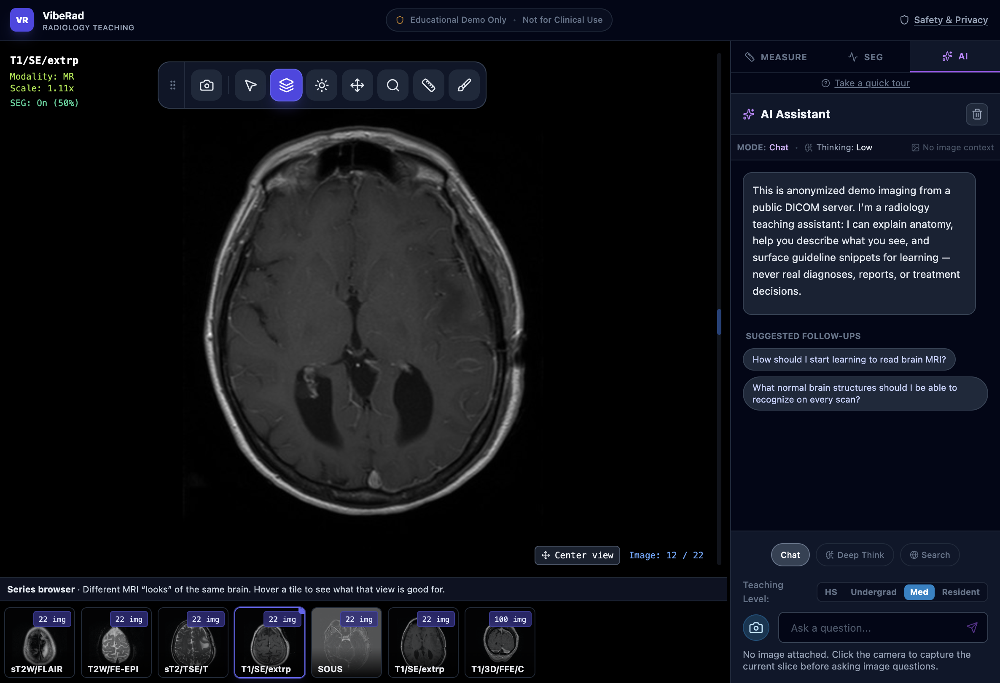

# VibeRad: Radiology Education Reimagined with Gemini 3 Pro

**VibeRad** is an AI-powered DICOM viewer and radiology teaching assistant designed to *reimagine learning* and *accelerate discovery*. Built for the **Google DeepMind - Vibe Code with Gemini 3 Pro** Kaggle hackathon, this application bridges the gap between complex medical imaging and accessible education using the latest advancements in reasoning and native multimodality from Gemini 3 Pro.

The core codebase was generated with Gemini 3 Pro in AI Studio, with human review and iteration, for the 2025 Google DeepMind – Vibe Code with Gemini 3 Pro in AI Studio Kaggle competition.

## The Vibe
Radiology is notoriously difficult to learn. VibeRad acts as an intelligent teaching assistant beside the student, capable of seeing what they see, reasoning through complex anatomy, and grounding findings in real-world medical guidelines.

> **Note:** This application is for **EDUCATIONAL USE ONLY**. It uses anonymized demo data and is not a medical device.

## Key Features

### Advanced Reasoning with Gemini 3 Pro
VibeRad uses **Gemini 3 Pro Preview** exclusively for all AI interactions, leveraging `thinking_level` to control reasoning depth.
- **Deep Think Mode:** Uses `thinking_level = "high"` and `media_resolution = "MEDIA_RESOLUTION_HIGH"` to reason through complex anatomical relationships and fine details before answering.
- **Chat Mode:** Uses `thinking_level = "low"` for low-latency, conversational interactions.
- **Search Mode:** Uses `thinking_level = "high"` combined with **Google Search Grounding** to cross-reference findings with up-to-date medical guidelines and literature.

### Adaptive Learning Levels
Education isn't one-size-fits-all. VibeRad adapts its teaching style and suggested follow-up questions based on the selected learner level:
- **High School:** Simple analogies, non-medical terms.
- **Undergrad:** Physics basics, biological context.
- **Med Student:** Clinical anatomy, checklists, standard terminology.
- **Resident:** Pearls, pitfalls, differentials, and guidelines.

### Camera-based Multimodality
To ensure transparency and control, VibeRad uses an explicit **capture-based vision system**:
- **Opt-in Vision:** Gemini 3 Pro does not passively watch the viewport. The user must click the **Capture 📸** button to explicitly send the current slice to the AI.
- **Persistent Context:** Once captured, that specific slice remains the "active context" for all subsequent questions until cleared.
- **No Hallucination:** If no image is captured, Gemini 3 is instructed to explicitly state that it cannot see the image.

### Full-Featured DICOM Viewer
VibeRad is a robust, browser-based DICOMweb viewer built from scratch in React:
- **Floating Toolbar:** A draggable, snap-to-edge toolbar for essential tools (Window/Level, Pan, Zoom, Capture).
- **Segmentation:** Pixel-perfect Paint/Erase tools with a layer management system.
- **Measurement:** Calibrated distance tools managed per-series.
- **Connection Diagnostics:** An integrated diagnostic suite that validates connectivity to ensuring reliable access to public medical imaging data.

### Interactive Onboarding
A built-in **Guided Tour** walks new users through the critical workflow: selecting a series, capturing a slice, and interacting with the AI Assistant.

## Suggested demo flow

**3 Steps: (1) Pick a series, (2) capture a slice with the camera, (3) ask VibeRad to teach you what you are seeing.**

1.  **Start VibeRad**: Launch the app. The connection diagnostics will automatically validate the link to the demo data.
2.  **Step 1 – Pick a series**: Select a brain MRI study. In the bottom "Series browser," select a distinct sequence (e.g., T1/SE/extrp) to load it.
3.  **Step 2 – Capture a slice**: Scroll to an anatomical slice of interest. Click the **Camera 📸** button on the floating toolbar. Note the thumbnail appearing in the AI panel.
4.  **Step 3 – Ask VibeRad**: Ensure the mode is set to **Chat** and the Teaching Level is set to **Med**. Ask: "What am I looking at?" or click a suggestion.
5.  **Deep Think Mode**: Switch to **Deep Think**. Click a complex follow-up (e.g., "Key structures"). Gemini 3 Pro will reason deeply to generate a structured teaching explanation.
6.  **Adjust Learner Level**: Change the level to **HS** (High School) or **Resident**. Watch the suggestions and AI persona adapt immediately.
7.  **Search Mode**: Switch to **Search** mode. Ask "What are the reporting guidelines for this anatomy?" to see grounded citations.

*All AI interactions run on `gemini-3-pro-preview`. The camera capture is required for multimodal reasoning to ensure the AI analyzes the exact pixel data you are viewing.*

## Dataset & Asset Pipeline

**Data Source:**
This dataset is **CC0 (Public Domain)**.
> Chris Rorden, John Absher, and Roger Newman-Norlund (2024). Stroke Outcome Optimization Project (SOOP). OpenNeuro. [Dataset] doi: 10.18112/openneuro.ds004889.v1.1.2.
> [https://openneuro.org/datasets/ds004889/versions/1.1.2](https://openneuro.org/datasets/ds004889/versions/1.1.2)

The application uses **Subject 1 (sub-1)** from this dataset. Specifically, the following NIfTI volumes were converted into 2D PNG series for web compatibility:
- `sub-1_FLAIR.nii.gz` (FLAIR)
- `sub-1_T1w.nii.gz` (T1 Weighted)
- `sub-1_rec-ADC_dwi.nii.gz` (ADC Map)
- `sub-1_rec-TRACE_dwi.nii.gz` (DWI Trace)

**Performance & Hosting:**
To ensure a high-performance, low-latency experience without requiring a complex DICOM backend:
1.  The NIfTI volumes were sliced into sequential PNG images.
2.  These assets are hosted directly in the public GitHub repository.
3.  The application loads these assets via **jsDelivr**, a global CDN. This effectively turns the GitHub repository into high-speed edge storage, ensuring instant loading times and smooth scrolling performance for users worldwide.

## Tech Stack & Implementation

- **Framework:** React 19.2.1 + TypeScript + Tailwind CSS
- **AI SDK:** `@google/genai` (v1.31.0)
- **Models:**
  - `gemini-3-pro-preview`
  - **Context Window:** 1M input tokens.
  - **Knowledge Cutoff:** Jan 2025.
- **Protocol:** DICOMweb (QIDO-RS, WADO-RS)
- **Icons:** Lucide React

### Code Highlights
- **`services/aiService.ts`**: Centralized logic for streaming chat, handling `thinking_level`, `media_resolution`, `googleSearch` tools, and inline JSON parsing for dynamic suggestions.
- **`components/ViewerCanvas.tsx`**: High-performance HTML5 Canvas rendering engine for DICOM frames and segmentation masks.
- **`components/FloatingToolbar.tsx`**: Draggable UI implementation for tool access.
- **`components/StudyList.tsx`**: Contains the logic for validating DICOMweb endpoints.

## Usage

1. **API Key:** The app requires a valid Google Cloud API Key with access to the Gemini API, injected via `process.env.API_KEY`.
2. **Data Source:** By default, the app connects to the demo dataset described above.
3. **Safety:** Upon launch, users must acknowledge the safety disclaimer.

## Hackathon Tracks
- **Education:** Reimagining how medical students and residents learn radiology using adaptive AI personas.
- **Health:** Improving future patient care by training better doctors with grounded, reasoning-capable AI.
- **Technology:** Pushing the boundaries of browser-based medical imaging with Gemini 3 Pro.

---
*Built using Google AI Studio.*

## Run and deploy your AI Studio app

This contains everything you need to run your app locally.

### Run Locally
Prerequisites: a recent version of Node.js.

1. Install dependencies: `npm install`
2. Set the `API_KEY` in `.env` to your Gemini API key
3. Run the app: `npm run dev`